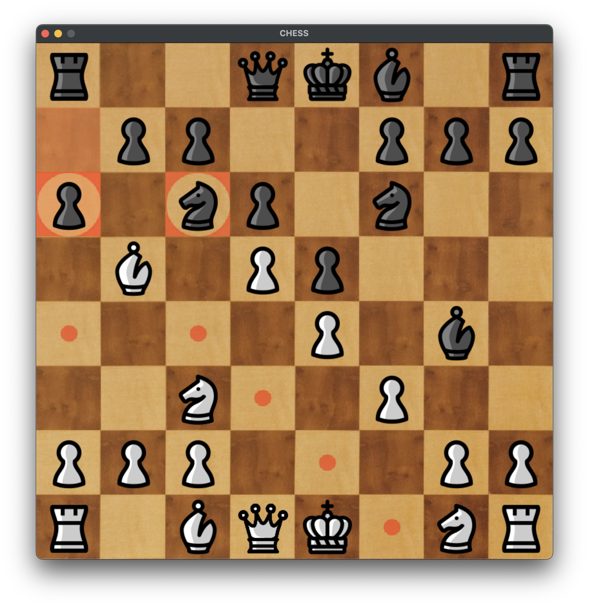
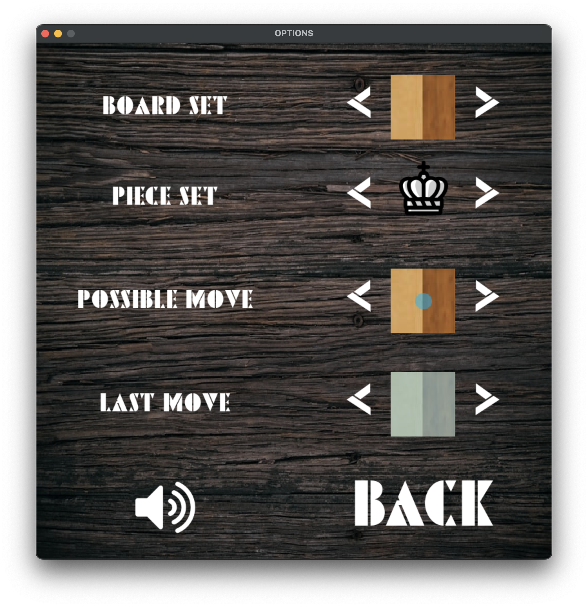

# Chess Game with AI



This is a chess game written in Python using the Pygame library. The chess engine employs the Minimax algorithm with alpha-beta pruning to determine the best moves.

## Table of Contents
- [Alpha-Beta Pruning Implementation](#alpha-beta-pruning-implementation)
- [Heuristics](#heuristics)
    - [Material Value](#material-value)
    - [Piece Position](#piece-position)
    - [Mobility](#mobility)
- [Setup Instructions](#setup-instructions)
    - [Using Virtual Environment (Recommended)](#using-virtual-environment-recommended)
    - [Without Virtual Environment](#without-virtual-environment)
- [Game Modes](#game-modes)
- [Customization](#customization)
- [License](#license)
- [Additional Notes](#additional-notes)
- [Performance Considerations](#performance-considerations)
- [Future Improvements](#future-improvements)

## Alpha-Beta Pruning Implementation

The alpha-beta pruning algorithm is implemented in the minimax function within the AI.py file. Here's how it works:

1. Recursive Search: The algorithm recursively explores possible moves up to a specified depth, alternating between maximizing (White) and minimizing (Black) players.

2. Move Generation: For each player, the function generates all possible legal moves by iterating over all pieces and collecting their move sets.

3. Alpha-Beta Pruning: The alpha and beta variables represent the minimum score that the maximizing player is assured and the maximum score that the minimizing player is assured, respectively. The algorithm prunes branches that cannot possibly affect the final decision:

    * Maximizing Player (White):

        * Updates alpha with the maximum value between alpha and the current evaluation.
        * Prunes the branch if beta <= alpha.

    * Minimizing Player (Black):

        * Updates beta with the minimum value between beta and the current evaluation.
        * Prunes the branch if beta <= alpha.

4. Terminal Conditions: The recursion stops when it reaches a specified depth or a terminal state (checkmate or draw).

5. Evaluation Function: At the leaves of the search tree, the algorithm evaluates the board using the evaluate function.

## Heuristics

The AI evaluates board positions using a heuristic function defined in the evaluate method in AI.py. The evaluation considers three main factors:

### 1. Material Value
Each piece type is assigned a material value:

- Pawn: 10
- Knight: 30
- Bishop: 35
- Rook: 50
- Queen: 90
- King: 1000 (used to represent checkmate conditions)

The material value is the sum of these values for all pieces of each player.

### 2. Piece Position
Positional values are assigned based on predefined tables. These tables provide bonuses or penalties depending on where a piece is located on the board. The values are designed to:

- Encourage central control.
- Promote piece development.
- Penalize pieces on poor squares.

### 3. Mobility
Mobility refers to the number of legal moves available to each piece. It is considered a minor factor and is weighted less heavily in the evaluation.

## Setup Instructions

### Using Virtual Environment (Recommended)

1. Clone the repository:
   ```
   git clone https://github.com/your-username/chess-game.git
   cd chess-game
   ```

2. Create a virtual environment:
   ```
   python3 -m venv chess_env
   ```

3. Activate the virtual environment:
   - On Unix or MacOS:
     ```
     source chess_env/bin/activate
     ```
   - On Windows:
     ```
     chess_env\Scripts\activate
     ```

4. Install the required packages:
   ```
   pip install pygame
   ```

5. Run the game:
   ```
   python main.py
   ```

### Without Virtual Environment

If you prefer not to use a virtual environment, you can install Pygame globally:

```
pip install pygame
python main.py
```

## Game Modes

1. **Player vs Player**: Two human players can play against each other.
2. **Player vs AI**: Play against the computer AI.

## Customization



The game offers various customization options:

- Chessboard Designs: Choose from multiple board textures.
- Piece Sets: Select different piece styles.
- Highlight Colors: Customize colors for possible moves and the last move made.
- Themes: Switch between light and dark themes.
- Sound: Toggle game sounds on or off.

Access these options through the Options menu in the game.

## License

This project is licensed under the MIT License - see the [LICENSE](LICENSE) file for details

## Additional Notes

### Performance Considerations

- Alpha-Beta Pruning significantly reduces the number of nodes evaluated in the search tree, improving performance.
- Heuristic Evaluation is critical for the AI's effectiveness. The balance between material, position, and mobility affects the AI's playing style.

### Future Improvements

- Transposition Tables: Implement caching of board evaluations to avoid redundant calculations.
- Opening Book: Implement an opening book to guide the AI's early moves.
- Neural Networks: Implement the position evaluation using a neural network.
- Parallel Search: Utilize multi-threading or multiprocessing to evaluate moves in parallel.
- Endgame Database: Integrate an endgame database to handle specific scenarios and improve decision-making in complex positions.
